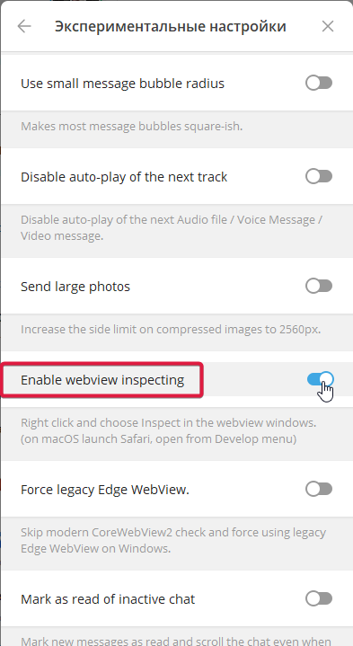

# AutoClicker-TapSwap
Автоматизация игры TapSwap через телеграмм браузер / Automating the TapSwap game via Telegram browser
> [!NOTE]
> Все вопросы и предложения
> - Контакты: [Telegram](https://t.me/farmtapplayrs001)
> - Канал: [Telegram Channel](https://t.me/Tap_Plays1)
---
## Как запустить  
- Установить расширение браузера: [Violentmonkey](https://chromewebstore.google.com/detail/violentmonkey/jinjaccalgkegednnccohejagnlnfdag?hl=be)
- Для установки самого **скрипта** установите [это расширение](https://github.com/TapPlays/AutoClicker-TapSwap/raw/main/tapswap-autoclicker.user.js)
- Открыть [Бота TapSwap](https://web.telegram.org/k/#?tgaddr=tg%3A%2F%2Fresolve%3Fdomain%3D@tapswap_bot%26start%3Dr_1895812375) и запустить игру в браузере
---
## Вы можете так же запускать скрипт через официальное приложение Telegram
- Установите бета верссию [Telegram](https://desktop.telegram.org/changelog#beta-version)
- Войдите в свой аккаунт и дальше по такому пути:
- **настройки** > **продвинутые настройки** > **эксперементальные настройки** > **Eneble webview inspecting**
 
- Открыть [Бота TapSwap](https://web.telegram.org/k/#?tgaddr=tg%3A%2F%2Fresolve%3Fdomain%3D@tapswap_bot%26start%3Dr_1895812375) и запустить игру в телеграме
- Нажмите правой кнопкой мыши по окну с игрой и выберите **Проверить**
- Выберите вкладку **Консоль** и вставте туда [данный код](script.txt)
- Нажмите **Enter**
---
> [!TIP]
> - [NotPixel](https://github.com/TapPlays/AutoClicker-NotPixel)
> - [Blum](https://github.com/TapPlays/AutoClicker-Blum)
> - Так же в моем канале вы можете купить **рефералы**, **накрутку**, **RU номера** и **аккаунты**
> - Канал: [Telegram Channel](https://t.me/Tap_Plays1)
